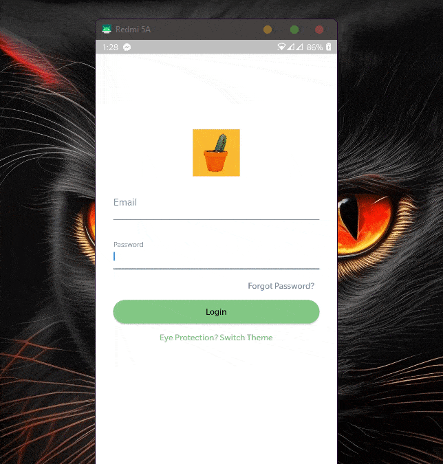

# Flutter Fake Store API (MVVM+Riverpod)

This is a Flutter application that provides a Material Design user interface and backend using resreq & Fakestore api. The app allows users to browse through different categories of product from fake store API, search for specific Product, and view details about each Product.Followed by MVVM Architecture.

## Screen REC

## Features
- Login using API
- Change and save theme
- Route Management and Dynamic Rating Function
- Browse through different categories of product
- Search for specific Products
- View details about each product
- Save favorite product in my cart
- Responsive design for different screen sizes

## Getting Started

1. Clone this repository
2. Open the project in your preferred IDE (e.g. Android Studio, Visual Studio Code)
3. Install the necessary dependencies by running `flutter pub get`
4. Run the app on an emulator or physical device by running `flutter run`

## Dependencies

- [flutter_riverpod](https://pub.dev/packages/flutter_riverpod) for state management
- [shared_preference](https://pub.dev/packages/shared_preference) for shared preferences
- [http](https://pub.dev/packages/http) for API request
- [lottiefiles](https://pub.dev/packages/lottiefiles) for displaying Lottie Files
- [flutter_svg](https://pub.dev/packages/flutter_svg) for displaying SVG images 
- [animated_shimmer](https://pub.dev/packages/animated_shimmer) for displaying shimmer effect 
- [MVVM Architecture](hhttps://arrahmanbd.github.io/) for Separating business logic

## 🔗 Follow

